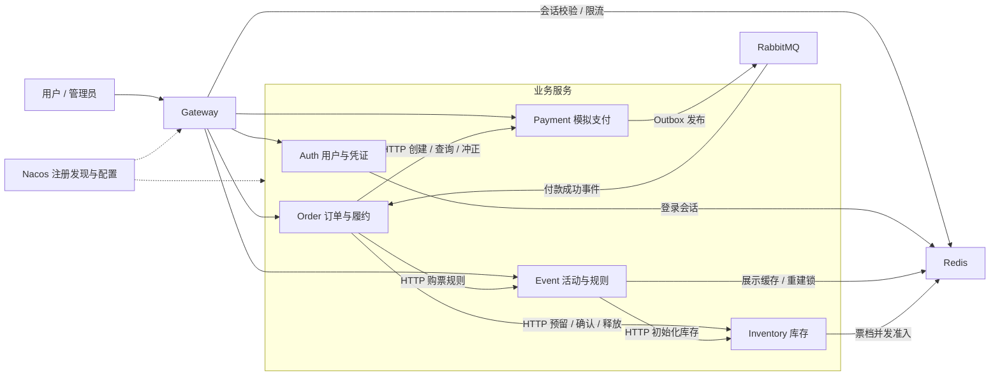

# 分布式票务交易平台

基于 **Spring Boot / Spring Cloud** 的活动票务交易后端，覆盖从管理员创建活动、准备库存和发布，到用户购票、模拟付款、库存确认及电子票生成的完整流程。

项目拆分为 **6 个独立微服务、4 个公共模块、5 个业务数据库**。围绕跨服务交易，实现了可靠消息、最终一致性、缓存与限流、热点库存保护、故障隔离、分布式追踪和容器部署。

## 核心业务功能

| 业务 | 已实现功能 |
| --- | --- |
| 用户与认证 | 注册、登录、刷新凭证、退出登录；普通用户与管理员权限；JWT 签名及 Redis 会话校验 |
| 活动管理 | 创建包含场次和票档的完整草稿，后台初始化库存，查询准备进度、按原参数重新准备、发布活动 |
| 活动查询 | 已发布活动分页、详情、场次和票档查询；Redis 展示缓存及热点重建保护 |
| 订单与限购 | 购票规则及金额预览、创建订单、按编号查询本人订单；价格快照、购买幂等键、同用户同场次累计限购 |
| 库存管理 | 初始化、预留、确认售出、释放及事实查询；条件更新防止超卖，重复请求核对原参数 |
| 模拟支付 | 从原订单创建支付单、查询本人支付单、模拟付款成功；付款事实核对及迟到付款全额模拟冲正 |
| 电子票 | 完成库存确认后生成唯一电子票，查询本人订单的票券，重复履约不重复出票 |
| 异常恢复 | 未付款超时关闭、库存释放、临时故障重试、响应丢失核对、宕机后任务接管及矛盾事实人工核对标记 |

## 系统架构



- **统一入口**：用户和管理员通过 Gateway 访问公开 API；内部协作接口由服务凭证控制调用方向、路径和 HTTP 方法。
- **注册与调用**：Nacos 提供实例发现和集中配置。Gateway 使用 `lb://` 路由，业务客户端使用 `@LoadBalanced RestClient` 发送 HTTP 请求。
- **数据边界**：每个业务服务只访问自己的数据库，通过 HTTP 契约和 MQ 事件交换信息。
- **观测链路**：HTTP、MQ 及后台恢复任务关联到 Tempo；Prometheus 采集指标，Grafana 展示链路、面板及告警。

## 完整交易流程

### 活动发布

管理员登录 → 创建活动、场次和票档草稿 → Event 保存初始化快照 → 后台调用 Inventory 准备库存 → 核对所有票档为 `READY` → 发布活动。

只有库存准备完成后才能发布。Event 保存计划参数，Inventory 维护实际可用、预留和售出数量。

### 用户购票

1. 用户登录，浏览已发布活动和票档。
2. Order 通过 HTTP 查询 Event 的购票规则，校验销售时间、购买数量和累计限购。
3. Order 本地事务保存订单、价格快照及额度占用，再调用 Inventory 预留库存。
4. 用户从原订单发起支付，Payment 创建或返回已有支付单。
5. 模拟付款成功时，Payment 在同一事务中保存付款事实和 Outbox 事件。
6. 发送任务将事件投递到 RabbitMQ；Order 消费后回查 Payment 的付款事实。
7. Order 在同一事务中保存消费记录和付款依据，提交后 ACK。
8. 后台任务确认库存售出，完成订单并生成电子票，用户通过网关查询结果。

正常订单状态：

```text
STOCK_PENDING → PENDING_PAYMENT → PAYMENT_CONFIRMING → PAID → COMPLETED
```

未付款到期时进入关闭流程，释放库存并归还购买额度；库存已释放后出现成功付款时执行模拟冲正。永久事实冲突保存为 `REVIEW_REQUIRED`，供人工核对。

## 关键技术方案

| 要解决的问题 | 实现方案 |
| --- | --- |
| 服务发现与配置管理 | Nacos 注册发现、公共与服务配置；日志级别和 Event 缓存 TTL 动态刷新 |
| 跨服务身份验证 | Auth 签发 RS256 JWT，网关和业务服务独立校验签名与 Redis 会话；内部接口使用分方向凭证 |
| 跨库交易与网络结果不确定 | 本地事务、持久化状态、唯一键、原参数幂等、事实核对、租约领取、退避重试和补偿 |
| 付款事件可靠传递 | RabbitMQ + Outbox，发布 Confirm / Return 检查，消费事务提交后 ACK，消费幂等、三档延迟重试和死信重投 |
| 热点查询与缓存重建竞争 | 展示缓存、空结果短缓存、TTL 抖动、Redis 重建锁、随机令牌校验、提交后版本失效及受控回源 |
| 入口突发请求 | WebFlux 响应式 Redis Lua 令牌桶，活动查询与订单请求按全局及用户 / IP 限流 |
| 热点库存行竞争 | 事务前申请 Redis 按票档共享的并发额度，满额返回 `STOCK_BUSY`；MySQL 条件更新及事务保证库存正确 |
| 下游故障扩散 | Resilience4j 熔断、并发隔离、HTTP 超时及故障分类；写请求由业务流程核对和重试 |
| 请求和后台任务难以排查 | Micrometer Tracing + OpenTelemetry + Tempo，持久化并恢复异步追踪上下文，关联 HTTP、MQ 和恢复任务 |
| 服务故障和业务积压不可见 | Prometheus 指标、Grafana 11 个面板和 10 条告警规则，覆盖服务健康、延迟、恢复积压、死信和采样异常 |
| 多实例接管与部署复现 | Docker Compose、健康检查、独立数据卷、只读凭证挂载；订单双实例、优雅停止、有界读取故障切换 |

一致性采用可恢复的最终一致性。消息发布确认和消费 ACK 分别对应投递与接收阶段，完整出票以订单达到 `COMPLETED` 为准。

## 技术栈

| 类别 | 技术 |
| --- | --- |
| 语言与构建 | Java 17、Maven 多模块 |
| 应用框架 | Spring Boot 4.0.8、Spring Cloud 2025.1.3、Spring Cloud Alibaba 2025.1.0.0 |
| Web 与网关 | Spring MVC、Spring Cloud Gateway / WebFlux、Reactor |
| 认证 | Spring Security、JWT / RS256、BCrypt、Redis 会话 |
| 数据访问 | MySQL 8、MyBatis-Plus 3.5.17、Flyway |
| 注册与配置 | Nacos 3.1.2 |
| 缓存与并发控制 | Redis 7.4、Lua |
| 消息 | RabbitMQ 4.3.6、Spring AMQP、Outbox |
| 调用保护 | Resilience4j 2.4.0 |
| 追踪与监控 | Micrometer、OpenTelemetry、Tempo、Prometheus、Grafana |
| 部署与接口调试 | Docker Compose、PowerShell / CMD 启动入口、OpenAPI / Apifox |

版本以父 [pom.xml](pom.xml) 和 [compose.yml](compose.yml) 为准。

## 工程结构

| 模块 | 默认业务端口 | 职责 |
| --- | --- | --- |
| `ticket-gateway` | 8060 | 路由、响应式认证、限流、Order 读取故障切换 |
| `ticket-event-service` | 8061 | 活动、场次、票档、购票规则及库存准备 |
| `ticket-order-service` | 8062 | 订单、价格快照、限购、履约恢复、消费记录和电子票 |
| `ticket-inventory-service` | 8063 | 库存、预留、确认、释放及热点准入 |
| `ticket-payment-service` | 8064 | 模拟支付、Outbox、付款通知及模拟冲正 |
| `ticket-auth-service` | 8065 | 用户、凭证签发、刷新及会话 |
| `ticket-common` | 不独立启动 | 统一结果、异常、traceId 和基础支持 |
| `ticket-security` | 不独立启动 | 用户认证及内部服务凭证支持 |
| `ticket-resilience` | 不独立启动 | HTTP 熔断与并发隔离组件 |
| `ticket-observability` | 不独立启动 | 追踪上下文、异步 Span 和工作流指标 |

五个独立业务库共 **14 张业务表**，另有各库的 Flyway 迁移历史表：

| 数据库 | 业务表数量 | 数据所有权 |
| --- | --- | --- |
| `ticket_auth` | 1 | 用户 |
| `ticket_event` | 3 | 活动、场次、票档及准备进度 |
| `ticket_order` | 5 | 订单、订单项、电子票、累计限购及消费记录 |
| `ticket_inventory` | 2 | 库存及预留记录 |
| `ticket_payment` | 3 | 支付、模拟冲正及 Outbox 事件 |

数据库结构由各业务服务 `src/main/resources/db/migration/` 下的 Flyway SQL 管理。

## 快速开始

当前提供 Windows 本地 Docker 部署。需要 Docker Desktop 的 Linux 引擎、JDK 17、Maven 和 Nacos 3.1.2 官方发行包；首次构建需能下载 Maven 依赖和缺失的基础镜像。

1. 设置 Windows 用户环境变量 `LOCAL_MYSQL_PASSWORD`，已有该变量时直接复用。该值用于本项目独立容器 MySQL 的首次初始化。
2. 将 Nacos 发行包的 `nacos` 目录放到 `.local/nacos-3.1.2/nacos`；其他安装路径及 JDK / Maven 路径可按 [Docker 启动指南](docs/docker-deployment.md) 指定。
3. 在项目根目录双击 `更新并启动.cmd`，完成打包、镜像构建及服务启动。

| 双击入口 | 用途 |
| --- | --- |
| [更新并启动.cmd](更新并启动.cmd) | 首次运行或修改 Java 代码后，重新打包并更新服务 |
| [启动项目.cmd](启动项目.cmd) | 日常启动，复用已生成的 JAR，默认运行两个 Order 实例 |
| [停止项目.cmd](停止项目.cmd) | 停止并移除项目容器，保留数据卷 |

也可在项目根目录 PowerShell 执行：

```powershell
# 构建并启动两个 Order 实例
./deploy/docker/start.ps1 -OrderReplicas 2

# 查看容器状态
./deploy/docker/status.ps1

# 停止项目，保留数据
./deploy/docker/stop.ps1
```

首次启动自动生成 JWT 密钥和内部服务凭证，初始化数据库并执行 Flyway 迁移，导入 Nacos 配置，加载 Grafana 数据源和面板。完整部署的 Compose 项目名为 `ticket-platform`，已包含追踪组件。

| 入口 | 本地地址 |
| --- | --- |
| 业务 API 网关 | http://localhost:18060 |
| Nacos 控制台 | http://localhost:18080 |
| RabbitMQ 管理页面 | http://localhost:15680 |
| Grafana | http://localhost:3002 |
| Prometheus | http://localhost:19090 |

管理员账号为 `docker_admin`，生成的密码位于 `.local/docker/admin.password`。密码、私钥、内部服务凭证和运行输出均保存在 Git 忽略目录 `.local/`，无需写入源码。

## API 与演示

[Apifox 使用指南](docs/apifox/README.md) 提供 **22 个公开接口、13 个内部接口**的 OpenAPI 契约，以及登录凭证、活动、订单和支付编号的变量提取脚本。日常交易调试导入公开接口，并将网关环境地址设置为 `http://localhost:18060`。

推荐演示顺序：管理员创建草稿 → 等待库存准备 → 发布 → 用户注册登录 → 浏览活动 → 幂等下单 → 模拟付款 → 等待订单完成 → 查询电子票 → 退出登录。

## 项目范围

当前功能通过 API 演示，支付与冲正为模拟实现；尚无业务前端和入场核验。活动管理支持创建、准备和发布，未提供已发布活动编辑、下架或库存调整。

库存数量由 MySQL 维护，Redis 用于缓存、会话、限流及票档并发准入。监控告警可在本地页面查看；Redis 库存预扣账本、库存分段和外部告警通知渠道未实现。容器配置面向本地学习，远程部署需另行配置访问控制。
