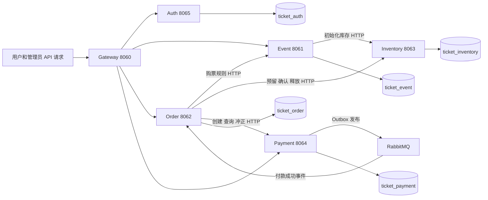
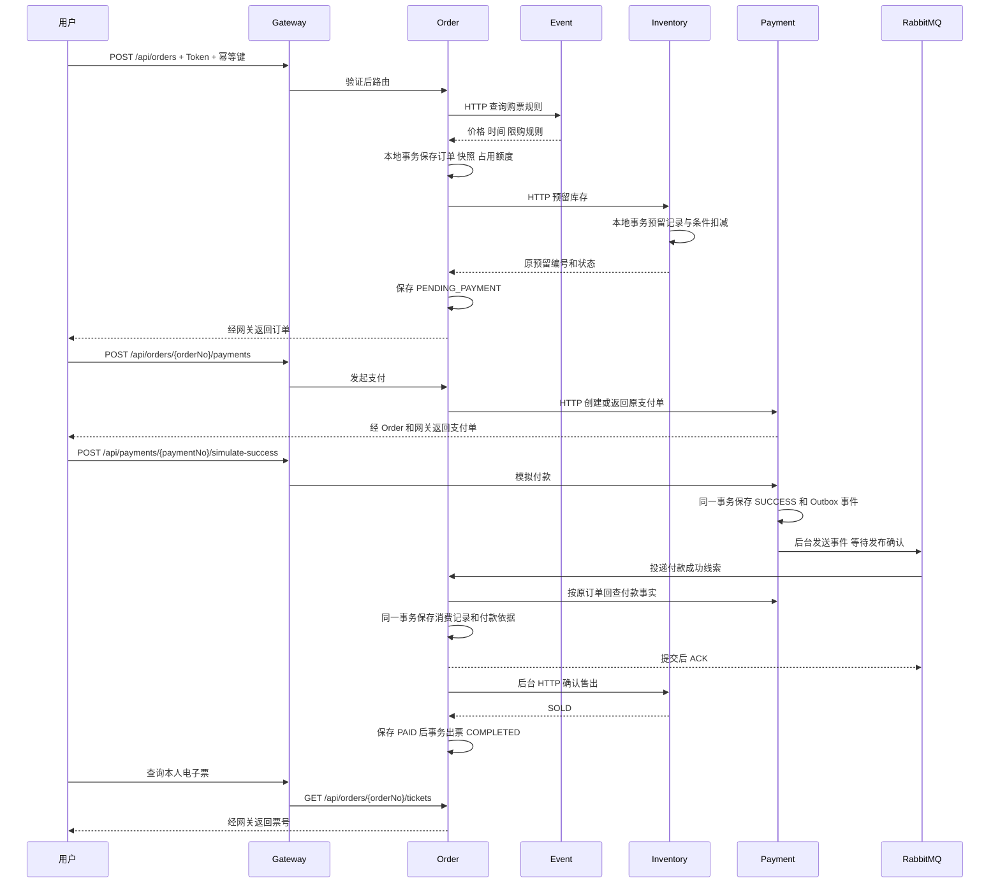

# 服务架构与交易流程

本项目通过六个独立进程协作完成票务交易。服务持有各自数据库，通过 HTTP 交换契约；付款成功事件由 RabbitMQ 投递。Nacos 提供实例地址和集中配置，公共 Maven 模块提供可复用代码。本文由第一版架构说明更新为当前第二版架构，保留原文件名以兼容文档链接。

## 服务架构

六个服务向 Nacos 注册。Gateway 的 `lb://服务名` 和业务端 `@LoadBalanced RestClient.Builder` 从发现信息中选择实例，之后直接向目标服务发 HTTP 请求；业务报文不经 Nacos 转发。启用 `nacos` profile 后加载公共和服务专属配置，Docker 启动默认导入七份配置；详见 [Nacos 配置中心](nacos-config.md)。

Auth 管理账号和登录会话；Redis 存储会话，各校验端确认 Token 对应会话仍有效。Gateway 使用 WebFlux、响应式 Redis；业务端采用 Spring MVC。当前 Redis 不存库存权威事实。

`ticket-common` 包含 Result、异常、traceId 与可选耗时工具；`ticket-security` 包含认证及服务凭证支持；`ticket-resilience` 提供 HTTP 熔断和并发隔离；`ticket-observability` 提供追踪上下文、异步 Span 和工作流指标。其他模块通过 Maven 使用其代码，这种依赖不会发起网络调用。Order 不依赖 Event、Inventory、Payment 的业务实体或 Mapper。

活动查询使用 Redis 缓存和重建锁，Gateway 使用 Redis Lua 令牌桶限流。库存预留在本地事务前申请按票档共享的 Redis 并发额度；可用、预留和售出数量仍以 MySQL 为准。业务 HTTP 客户端使用 Resilience4j 保护，HTTP、MQ 和后台任务追踪导出到 Tempo；Prometheus 与 Grafana 展示指标和告警。

## 创建活动与准备库存

管理员 Token → Gateway → Event 管理 Controller → Event 本地事务保存活动、场次和票档草稿。后台领取票档准备任务，事务外调用 Inventory；Inventory 幂等保存初始化事实，Event 核对后持久化 READY。全部票档 READY 才能在 Event 本地事务发布。

Event 中的计划数量是固定初始化参数快照。实际可用、预留、售出数量属于 Inventory，不能仅凭 Event 草稿落库判断库存已经准备完成。

## 正常交易顺序

付款接口返回 SUCCESS 表示支付服务已记录模拟付款，后台履约仍需推进。用户查询订单状态到 COMPLETED 才能确认完整出票。通知内容不能直接充当付款依据，Order 独立回查 Payment 并核对订单、金额等事实。

## 一致性与恢复

每个服务的 `@Transactional` 只控制自己的库。Order 保存进度，HTTP 在本地事务之外执行，避免把跨服务等待放进长事务。网络超时可能发生在对方提交以后，所以沿用原订单号、预留编号和参数核对或幂等重试。

| 场景 | 已实现处理 |
| --- | --- |
| 多请求抢同一库存 | Redis 按票档限制并发，MySQL 条件更新检查可用量，预留记录与数量变化同事务 |
| 重复下单与重复库存请求 | 购买幂等唯一键、库存订单编号唯一、参数核对 |
| 多实例或宕机恢复 | 数据库任务进度、领取租约、令牌条件更新、持久化退避 |
| 未付款到期 | CLOSING → 幂等释放库存 → CLOSED，同事务归还购买额度 |
| 支付通知丢失或重复 | 付款与 Outbox 同事务，发布确认及重试；Order 回查付款事实，消费记录与付款依据同事务，提交后 ACK |
| 已释放库存后收到成功付款 | REVERSAL_PENDING → 全额模拟冲正 → REVERSED，不重新抢回库存 |
| 重复出票 | 订单项与票序号唯一约束，全部票与 COMPLETED 同事务 |
| 互相矛盾的永久事实 | REVIEW_REQUIRED，保留证据供人工核对 |

主要正常状态为 `STOCK_PENDING → PENDING_PAYMENT → PAYMENT_CONFIRMING → PAID → COMPLETED`。库存状态为 `RESERVED → SOLD` 或 `RESERVED → RELEASED`，两种终态不能互相转换。

该方案提供可恢复的最终一致性，并非跨库原子提交；恢复依赖数据库、服务及后台任务重新可用。MQ 链路使用至少一次投递，Outbox 和消费记录处理消息进度，业务状态与库存事实仍需保留。详见 [支付消息与恢复](payment-mq.md)。应用仍保留关闭 MQ 时的 HTTP 通知兼容模式，Docker 默认开启 MQ。

## 两种身份

用户身份来自 Auth 的 JWT 和 Redis 会话，Gateway 及相关业务服务分别验证，在当前请求建立 Principal；服务进程之间不会传递同一个 Java Principal 对象。

内部身份来自分方向服务凭证，接收方同时检查路径和 HTTP 方法。Order 查询 Event、操作 Inventory、调用 Payment；Event 仅能初始化 Inventory；Payment 仅能通知 Order。用户或管理员 JWT 不能替代这些内部凭证，Gateway 不开放内部路由。

## 代码阅读入口

1. Gateway 的 `application.yml` 与 `GatewaySecurityConfig`：路由与身份准入；缓存和限流配置见 [缓存与限流](event-cache-rate-limit.md)。
2. Event 草稿事务、准备后台任务与内部 Controller：原子保存草稿，远程初始化库存，核对完成后发布。
3. [OrderServiceImpl](../ticket-order-service/src/main/java/com/byy/ticket/order/service/impl/OrderServiceImpl.java) → `EventClient` → `OrderTransactionService` → `OrderStockWorkflow` → `InventoryClient`：创建订单、保存进度并预留库存。
4. [InventoryServiceImpl](../ticket-inventory-service/src/main/java/com/byy/ticket/inventory/service/impl/InventoryServiceImpl.java) 与 `HotStockGate`、`TicketStockMapper`：共享准入额度、本地事务和条件更新。
5. Payment Outbox、Order 消费事务及原后台成交/冲正：代码入口见 [支付消息](payment-mq.md)。
6. [OrderTicketServiceImpl](../ticket-order-service/src/main/java/com/byy/ticket/order/service/impl/OrderTicketServiceImpl.java)：唯一电子票事务及本人查询。
7. 部署、多实例接管及读取保护见 [Docker 部署](docker-deployment.md) 和 [Order 故障切换](order-failover.md)；观测见 [链路追踪](http-tracing.md) 和 [指标告警](hot-stock-monitoring.md)。
