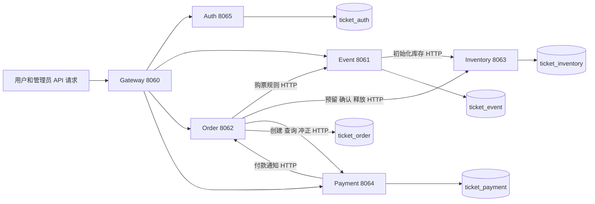
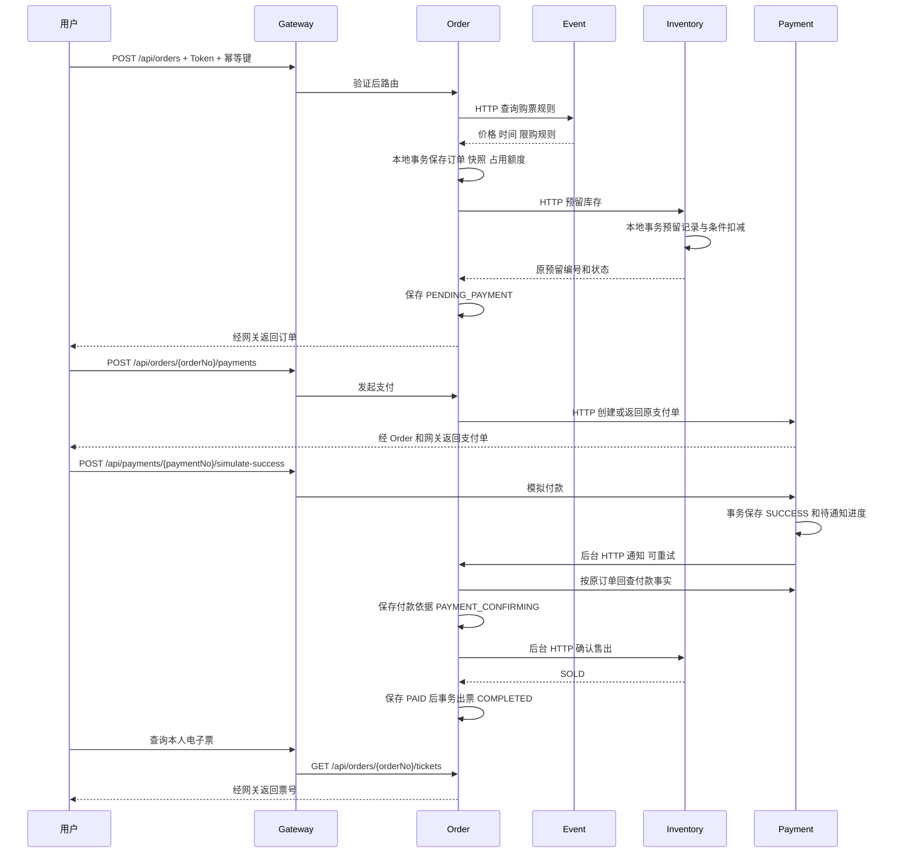

# 第一版架构与交易流程

本项目通过六个独立进程协作完成票务交易。服务持有各自数据库，通过 HTTP 交换契约；Nacos 提供实例地址，公共 Maven 模块提供可复用代码。

## 服务架构

六个服务向 Nacos 注册。Gateway 的 `lb://服务名` 和业务端 `@LoadBalanced RestClient.Builder` 从发现信息中选择实例，之后直接向目标服务发 HTTP 请求；业务报文不经 Nacos 转发。配置仅接入注册发现，尚未接入 Nacos 配置中心。

Auth 管理账号和登录会话；Redis 存储会话，各校验端确认 Token 对应会话仍有效。Gateway 使用 WebFlux、响应式 Redis；业务端采用 Spring MVC。当前 Redis 不存库存权威事实。

`ticket-common` 包含 Result、异常、traceId 与可选耗时工具；`ticket-security` 包含认证及服务凭证支持。其他模块通过 Maven 使用其代码，这种依赖不会发起网络调用。Order 不依赖 Event、Inventory、Payment 的业务实体或 Mapper。

## 创建活动与准备库存

管理员 Token → Gateway → Event 管理 Controller → Event 本地事务保存活动、场次和票档草稿。后台领取票档准备任务，事务外调用 Inventory；Inventory 幂等保存初始化事实，Event 核对后持久化 READY。全部票档 READY 才能在 Event 本地事务发布。

Event 中的计划数量是固定初始化参数快照。实际可用、预留、售出数量属于 Inventory，不能仅凭 Event 草稿落库判断库存已经准备完成。

## 正常交易顺序

付款接口返回 SUCCESS 表示支付服务已记录模拟付款，后台履约仍需推进。用户查询订单状态到 COMPLETED 才能确认完整出票。通知内容不能直接充当付款依据，Order 独立回查 Payment 并核对订单、金额等事实。

## 一致性与恢复

每个服务的 `@Transactional` 只控制自己的库。Order 保存进度，HTTP 在本地事务之外执行，避免把跨服务等待放进长事务。网络超时可能发生在对方提交以后，所以沿用原订单号、预留编号和参数核对或幂等重试。

| 场景 | 已实现处理 |
| --- | --- |
| 多请求抢同一库存 | 条件更新检查可用量，预留记录与数量变化同事务 |
| 重复下单与重复库存请求 | 购买幂等唯一键、库存订单编号唯一、参数核对 |
| 多实例或宕机恢复 | 数据库任务进度、领取租约、令牌条件更新、持久化退避 |
| 未付款到期 | CLOSING → 幂等释放库存 → CLOSED，同事务归还购买额度 |
| 支付通知丢失或重复 | Payment 保存待通知进度并重试，Order 回查并幂等保存付款依据 |
| 已释放库存后收到成功付款 | REVERSAL_PENDING → 全额模拟冲正 → REVERSED，不重新抢回库存 |
| 重复出票 | 订单项与票序号唯一约束，全部票与 COMPLETED 同事务 |
| 互相矛盾的永久事实 | REVIEW_REQUIRED，保留证据供人工核对 |

主要正常状态为 `STOCK_PENDING → PENDING_PAYMENT → PAYMENT_CONFIRMING → PAID → COMPLETED`。库存状态为 `RESERVED → SOLD` 或 `RESERVED → RELEASED`，两种终态不能互相转换。

该方案提供可恢复的最终一致性，并非跨库原子提交；恢复依赖数据库、服务及后台任务重新可用。MQ 和 Outbox 尚未实现，后续可迁移通知投递机制，业务状态与库存事实仍需保留。

## 两种身份

用户身份来自 Auth 的 JWT 和 Redis 会话，Gateway 及相关业务服务分别验证，在当前请求建立 Principal；服务进程之间不会传递同一个 Java Principal 对象。

内部身份来自分方向服务凭证，接收方同时检查路径和 HTTP 方法。Order 查询 Event、操作 Inventory、调用 Payment；Event 仅能初始化 Inventory；Payment 仅能通知 Order。用户或管理员 JWT 不能替代这些内部凭证，Gateway 不开放内部路由。

## 代码阅读入口

1. Gateway `application.yml` 与认证配置：路由与准入；见 [网关认证](gateway-auth.md)。
2. Event 草稿事务、准备后台任务与内部 Controller；见 [活动管理](event-administration.md)。
3. Order `OrderServiceImpl` → `EventClient` → `OrderTransactionService` → `OrderStockWorkflow` → `InventoryClient`；见 [订单流程](order-workflow.md)。
4. Inventory `InternalStockReservationController` → `InventoryServiceImpl` → `TicketStockMapper`：本地事务和条件更新。
5. Payment 通知、Order 付款依据与后台成交/冲正；见 [付款通知](payment-notification.md)、[履约恢复](payment-fulfillment.md)。
6. Order 电子票事务和查询；见 [电子票](ticket-issuance.md)。
